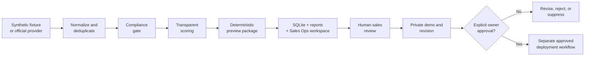

# SiteKapında — OpenAI Build Week submission

**A first working website arrives before the sales pitch.**

SiteKapında is an AI-assisted, human-approved website production workflow for local businesses that do not yet have a strong website. It discovers a qualified opportunity, produces a private first version, gives a salesperson something tangible to review with the owner, and keeps publication behind an explicit human approval gate.

This repository is the safe, judge-ready edition of the project. Its default path uses fictional businesses, requires no API key, makes no network request, and does not contact or publish anything.

## See it first

| Artifact | Link |
|---|---|
| 2:40 product video | [Watch on YouTube](https://youtu.be/ktev7Dng_jk) |
| Codex Sites demo | [Open the private-demo example](https://sedirra-sites-demo.haakanergun.chatgpt.site) |
| SiteKapında product site | [sitekapinda.com](https://sitekapinda.com) |
| Customer implementation example | [cagrikarakas.com](https://cagrikarakas.com) |

The Codex Sites demo is a hosted companion artifact. The Çağrı Karakaş link is a separate customer implementation example; neither is generated by the synthetic judge run below.

## Clone and open in Codex

1. Clone this GitHub repository, or use GitHub's **Code → Download ZIP** and extract it normally.
2. In the Codex desktop app, IDE extension, or CLI, open the repository root—the folder that directly contains `AGENTS.md`, `README.md`, `pyproject.toml`, and `src/`.
3. Start a new task from that root. No plugin installation is required for the default path; Codex automatically receives the checked-in `AGENTS.md` repository guidance.
4. Send the prompt below. Codex can run the platform-specific bootstrap, verify the tests, and show the generated Sales Ops workspace and one synthetic preview.

```text
Read README.md and AGENTS.md. Run the safe synthetic judge path, verify all
tests, and show me the generated English Sales Ops workspace plus one preview.
Do not enable real discovery, contact anyone, upload data, or publish anything.
```

Expected local outputs are `runtime/generated/index.html`, `runtime/generated/mockups/`, `runtime/generated/demos/`, `runtime/reports/`, and `runtime/sitekapinda.sqlite3`. Installing the bundled SiteKapında plugin is optional; it adds five named reusable workflows but is not required to run or judge the repository.

## Five-minute judge path

Prerequisite: Python 3.10 or newer. Node, Docker, an OpenAI API key, and a Google API key are not required.

Windows PowerShell:

```powershell
powershell -ExecutionPolicy Bypass -File .\scripts\bootstrap.ps1
```

macOS or Linux:

```bash
bash ./scripts/bootstrap.sh
```

The bootstrap is idempotent. It creates an isolated `.venv`, writes a local `.env` only when one does not already exist, runs the environment doctor, runs the unit tests, and executes one synthetic discovery cycle. It does not install third-party Python packages or use the network.

After it finishes, inspect:

- `runtime/generated/index.html` — the English Sales Ops master-detail workspace, populated only from the local synthetic pipeline
- `runtime/generated/mockups/` — twenty-four full website UI mockups produced with GPT Image: a separately composed desktop and mobile design for each fictional business
- `runtime/generated/demos/` — supplementary deterministic HTML preview packages used to demonstrate the downstream build stage; the Sales Ops workspace deliberately presents the GPT Image mockups instead
- `runtime/reports/` — JSON, Markdown, CSV, and lead reports
- `runtime/sitekapinda.sqlite3` — local state and suppression records

For the exact verification checklist and manual commands, see [Judge test guide](docs/JUDGE_TEST_GUIDE.md).

## What runs today

The submitted application core is a deterministic Python and SQLite pipeline:

1. A provider returns normalized business candidates.
2. Stable identifiers are deduplicated and previously processed or suppressed records are skipped.
3. A deterministic compliance gate rejects unsupported or sensitive categories.
4. A transparent ruleset classifies website strength and scores the opportunity.
5. A configured number of eligible candidates receive responsive, explicitly labelled, `noindex,nofollow` preview packages. The application default is five; the synthetic judge bootstrap uses twelve so every packaged category and asset pair is visible.
6. SQLite records provenance, decisions, run events, lead status, and suppression state.
7. The English Sales Ops workspace presents a business-specific GPT Image desktop website design and an independently composed mobile design for each lead. It does not embed HTML, use iframes, or crop the desktop image into a phone.
8. Report exports support human review; no production customer record or external action is bundled.

The default `mock` provider reads entirely fictional data from `data/mock_places.json`. An optional `real` provider demonstrates a narrow integration with the official Google Places Text Search API and an explicit field mask. The judge path does not enable or need it.

## Where OpenAI is used — and where it is not

| Layer | Role in the project |
|---|---|
| OpenAI Codex | Architecture audit, multi-agent implementation, code review, tests, design iteration, browser validation, packaging, and reusable SiteKapında workflow skills |
| GPT-5.6-class Codex models | Reasoning and implementation inside the Codex authoring workflow; the repository does not hardcode or call a GPT-5.6 API model |
| GPT Image / `imagegen` | Produced twenty-four complete, high-fidelity website UI mockups during the authoring workflow—an independent desktop and mobile composition for each of twelve fictional businesses—plus rights-safe sector photography used as visual context; the offline Python runtime makes no model call |
| Codex Sites | Hosted demonstration of the private-review step before an approved public launch |
| Python runtime | Deterministic discovery, compliance, scoring, preview packaging, persistence, English Sales Ops workspace generation, and exports |
| React/Next.js companion | Source for the fictional Sedirra Sites demonstration under `apps/sites-demo/`; separate from the Python judge bootstrap |

There is intentionally **no OpenAI SDK dependency and no OpenAI API call in the submitted Python core**. The bundled Codex skills are reusable operating instructions for a human-supervised workflow; they are not a concealed autonomous service. This boundary makes the demonstration reproducible while keeping model-assisted creative work auditable.

Read [How Codex was used](docs/CODEX_USAGE.md) for prompts, skill roles, and the exact capability boundary.

## Architecture at a glance



Only the solid local path through Sales Ops workspace generation runs in this repository. Contact, domain registration, and public deployment are deliberately outside the automatic judge run.

For component and state details, see [Architecture](docs/ARCHITECTURE.md).

## Repository map

```text
.
├── AGENTS.md                 # durable instructions when opened in Codex
├── apps/sites-demo/          # source of the fictional hosted Sites companion
├── codex/                    # versioned prompts, routing note, automation template
├── data/                     # fictional judge fixture
├── docs/                     # judge-facing evidence and boundaries
├── media/                    # Build Week submission thumbnail
├── plugins/sitekapinda/      # installable Codex workflow skills
├── scripts/                  # bootstrap, doctor, one-shot, and hourly helpers
├── src/sitekapinda/          # deterministic Python application
├── tests/                    # offline unit and integration tests
├── .env.example              # safe local defaults; no credentials
├── SUBMISSION_MANIFEST.json  # machine-readable components, evidence, and checks
└── pyproject.toml            # zero-runtime-dependency Python package
```

The Python core is the required offline judge path. `apps/sites-demo/` is a separate Next.js/React/TypeScript companion with its own lockfile and test command; bootstrap does not download its packages or start it. See its local `README.md` if you want to reproduce the hosted visual demonstration.

The optional hourly helper is a foreground local loop. It is not enabled by bootstrap and it is not a hosted autonomous agent:

```powershell
.\scripts\run_hourly.ps1
```

```bash
bash ./scripts/run_hourly.sh
```

Stop it with `Ctrl+C`.

## Open in Codex

Open this repository root as a Codex project. Codex reads the checked-in `AGENTS.md`, which supplies the run commands, verification standard, and safety boundaries.

No plugin installation is required. Start a new Codex task and use:

```text
Read README.md and AGENTS.md. Run the safe synthetic judge path, verify all
tests, and show me the generated English Sales Ops workspace plus one preview.
Do not enable real discovery, contact anyone, upload data, or publish anything.
```

Optionally, install the local SiteKapında plugin described in [CODEX_USAGE.md](docs/CODEX_USAGE.md), start a new task, and use:

```text
Use $sitekapinda-setup to verify this repository, run the synthetic judge path,
and show me the generated English Sales Ops workspace and one synthetic preview.
Do not enable real discovery, contact a business, upload data, or publish a site.
```

The other bundled skills cover discovery review, private-preview review, sales-state operations, and launch/maintenance planning. External actions always require separate user authorization.

## Safety by default

- Synthetic fixture data is the default and contains no real contactable business.
- Synthetic phone and WhatsApp controls are rendered as local/inert demo actions, never outbound links.
- Generated previews declare that they are demonstrations and include `noindex,nofollow`.
- Review text, scraped HTML, raw provider responses, and unnecessary personal data are not stored.
- Unsupported or sensitive categories are rejected before generation.
- `do_not_contact` writes to the suppression list and prevents reprocessing.
- The repository contains no secrets, production customer database, live admin credentials, Cloudflare identifiers, or historic runtime artifacts.
- Outreach, account changes, purchases, domain registration, and public deployment do not run without explicit human action.

See [Safety and data boundary](docs/SAFETY_AND_DATA_BOUNDARY.md) and [Security policy](SECURITY.md).

## Tests

Bootstrap runs the suite automatically. To repeat it:

Windows:

```powershell
$env:PYTHONPATH = (Resolve-Path .\src)
.\.venv\Scripts\python.exe -m unittest discover -s tests -p "test_*.py" -v
```

macOS or Linux:

```bash
PYTHONPATH=src ./.venv/bin/python -m unittest discover -s tests -p 'test_*.py' -v
```

The nineteen-test offline suite covers compliance, scoring, multi-family responsive preview generation, desktop/mobile asset provenance, persistence, sales state, sandboxed live-frame emission, hostile-text and external-demo-path safety, idempotency, fixture safety, and the complete mock pipeline. It is not presented as exhaustive production coverage. The expected result is nineteen passing tests with no network access.

## Honest limitations

- The Sales Ops preview surface uses twenty-four complete GPT Image website UI mockups. Each sector has its own composition and each mobile design was composed independently rather than cropped from desktop.
- The deterministic HTML packages remain supplementary evidence of the later implementation stage; GPT Image is not called by the offline Python process. Bootstrap copies the checked-in mockups locally but does not regenerate them or call an OpenAI API.
- Real provider mode requires the user's own Google Places API key, network access, quota, and acceptance of the provider's terms.
- The submitted package does not send outreach, buy domains, modify Cloudflare, or publish customer websites.
- The Sites demo and customer example are externally hosted evidence; local bootstrap remains useful if either external URL is unavailable.
- Production authentication, multi-tenant isolation, queues, retries, observability, and a recorded owner-approval service remain future hardening work.

## Build Week disclosure

SiteKapında began as an existing product idea and prototype. Build Week work focused on turning it into a truthful, reproducible, safety-bounded system and demonstration: the runtime was audited, the Codex-assisted workflow was formalized, design and demo assets were iterated, a hosted Sites example and video were produced, and this clean synthetic submission package was created.

The detailed before/during/after boundary is in [Build Week changes](docs/BUILD_WEEK_CHANGES.md).

## Documentation

- [Judge test guide](docs/JUDGE_TEST_GUIDE.md)
- [Architecture](docs/ARCHITECTURE.md)
- [How Codex was used](docs/CODEX_USAGE.md)
- [Safety and data boundary](docs/SAFETY_AND_DATA_BOUNDARY.md)
- [Build Week changes](docs/BUILD_WEEK_CHANGES.md)
- [Security policy](SECURITY.md)

## License

Released under the [MIT License](LICENSE). External brand names, linked websites, and customer-owned content remain the property of their respective owners.
