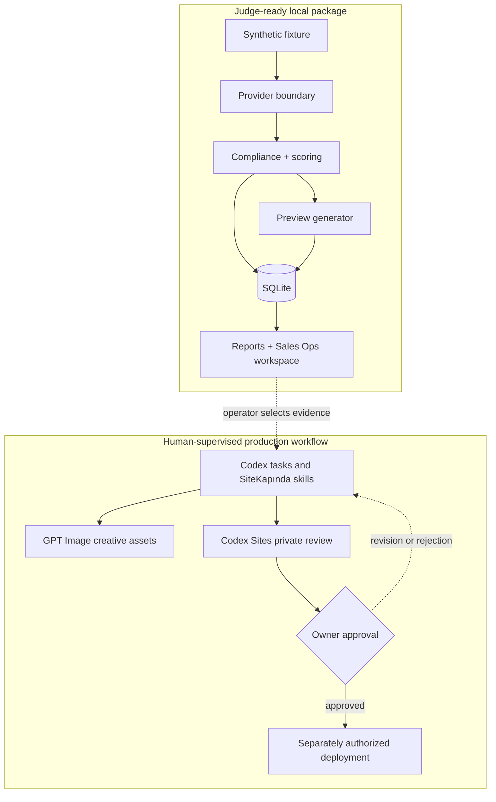
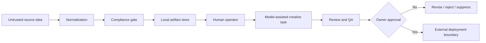

# Architecture

## System intent

SiteKapında reduces the trust gap in small-business website sales: the owner can react to a business-specific first version instead of purchasing an abstract promise.

The submitted architecture deliberately separates two systems:

1. **A reproducible local application** — deterministic Python, SQLite, HTML, CSS, and JavaScript that judges can run offline.
2. **An AI-assisted production workflow** — Codex tasks, reusable skills, GPT Image creative work, Codex Sites private demos, and separately authorized deployment operations.

The second system helps people build and operate the product. It is not disguised as a model API inside the first system.

## Context diagram



The dashed connection is an operating handoff, not an API integration in the submitted runtime.

## Local runtime flow

### 1. Configuration

`sitekapinda.config.AppConfig` reads explicit environment variables and resolves local paths. The default mode is `mock`.

Important defaults:

- mode: `mock`
- maximum selected per run: `5`
- minimum score: `60`
- database: `runtime/sitekapinda.sqlite3`
- generated output: `runtime/generated/`
- reports: `runtime/reports/`
- fixture: `data/mock_places.json`

Bootstrap writes a safe local `.env` only if one is absent. The application itself uses environment variables; it does not require a secrets framework for mock mode.

### 2. Provider boundary

All discovery providers implement the same small contract and yield normalized `BusinessCandidate` values.

- `MockProvider` reads fictional `source=synthetic_fixture` rows.
- `GooglePlacesProvider` is an optional example using the official Places Text Search endpoint, a declared field mask, and the user's API key.

Providers do not expose raw payloads to persistence or page generation. The optional real provider excludes review text from its field mask. Real mode is not enabled by bootstrap or required for judging.

### 3. Deduplication and suppression

The pipeline deduplicates candidates by stable `place_id`. Before any further work it asks the repository whether the identifier was already processed or added to `suppression_list`.

This makes repeated runs idempotent for the same fixture and prevents a `do_not_contact` record from silently re-entering the sales flow.

### 4. Deterministic compliance

`screen_candidate()` checks category support, sensitive/regulated keywords, stable identity, and required display name. It returns structured allow/deny reasons.

Generated HTML passes a second deterministic validator. It requires:

- a `noindex,nofollow` robots directive
- an explicit SiteKapında preview disclaimer
- an explicit statement that owner approval is required
- no forbidden ranking or guarantee claims
- no copied review section or review text

A failed validation blocks writing the preview package.

### 5. Transparent scoring

`score_candidate()` uses an inspectable ruleset rather than a hidden model score. Signals include:

- missing or weak website
- supported-category weight
- available public contact channel
- usable locality
- bounded public reputation metadata such as count/rating, but never review text

Low-rating, missing-contact, unsupported-category, and below-threshold reasons remain visible in the run events.

### 6. Preview packaging

`PageGenerator` converts each selected candidate into a deterministic package:

```text
runtime/generated/demos/<business-slug>/
├── index.html
├── brand-kit.json
├── image-prompts.json
├── page-manifest.json
└── assets/
    ├── hero-desktop.png
    └── hero-mobile.png
```

The HTML is a real responsive page. Category routing selects among ten visual families and seven distinct content compositions. A `<picture>` element switches between independently composed desktop and mobile GPT Image assets at the mobile breakpoint; the phone experience is not a crop of the desktop preview. The JSON artifacts expose business inputs, layout identity, creative tokens, asset provenance, and image direction so a human/Codex production task can refine the first version without making the deterministic runtime pretend it invoked an image model.

### 7. Persistence and reporting

SQLite is the local source of truth for the demonstration. Main tables:

- `businesses` — normalized evidence, score, technical status, sales status, minimal note, and preview path
- `suppression_list` — stable identifier and reason
- `run_reports` — aggregate result and report locations
- `run_events` — per-candidate decisions and reasons

Each run refreshes:

- a static English Sales Ops master-detail workspace under `runtime/generated/`
- CSV and JSON lead exports
- detailed JSON and Markdown run reports

The workspace shell is the English master-detail interface shown in the video, while `panel-data.js` is serialized exclusively from synthetic SQLite lead records in judge mode. Each safe fixture identifier may resolve only to two contained local paths: `mockups/<safe-place-id>-desktop.png` and `mockups/<safe-place-id>-mobile.png`. The panel renders those full GPT Image website designs as inert images inside desktop and phone presentation frames; there are no iframes, scripts, forms, popups, downloads, or external navigation in the preview surface. Browser-only status and note overrides use `localStorage`; there is no production data, backend endpoint, outreach action, or publication control in this judge surface.

No server is required. A local static server is useful only for convenient browser inspection.

## State model

Technical processing and sales intent are kept separate.

Technical examples:

```text
candidate
  -> skipped_compliance
  -> skipped_low_score
  -> generated
  -> generation_failed
```

Sales lifecycle:

```text
ready -> contacted -> interested -> approved
   \          \           \
    +----------+-----------+--> rejected
    +----------+-----------+--> do_not_contact -> suppression_list
```

The CLI validates sales statuses against:

- `ready`
- `contacted`
- `interested`
- `approved`
- `rejected`
- `do_not_contact`

An `approved` lead is still not automatically deployed. Design approval and public publication are separate real-world decisions; deployment is outside the mock runtime.

## Codex extension layer

The checked-in plugin packages five reusable workflows:

- `sitekapinda-setup` — inspect prerequisites and run the safe local demonstration
- `sitekapinda-discover` — operate or review discovery within source and compliance boundaries
- `sitekapinda-preview` — inspect/build a private noindex first version
- `sitekapinda-sales` — review exports and update a lead's local lifecycle state
- `sitekapinda-launch-maintain` — plan revisions, deployment, and maintenance while protecting approval gates

These skills tell Codex how to use repository commands and when to stop for human authorization. They do not embed credentials, schedule themselves, or turn a prompt into a production service. Model selection remains in the user's Codex environment.

## Hosted evidence

The source for the fictional Sedirra companion is included at `apps/sites-demo/`. It is a separate Next.js/React/TypeScript application with a lockfile, synthetic image provenance, `noindex,nofollow` metadata, and no real booking/contact channel. It is not installed, built, or served by the Python bootstrap.

An optional source-level check requires Node.js 22.13 or newer and package-registry access:

```bash
cd apps/sites-demo
npm ci
npm test
npm run lint
```

This optional path is not needed to evaluate the deterministic core.

- [Codex Sites demo](https://sedirra-sites-demo.haakanergun.chatgpt.site) demonstrates the private-review experience.
- [sitekapinda.com](https://sitekapinda.com) presents the product.
- [cagrikarakas.com](https://cagrikarakas.com) is a separate customer implementation example.

The links prove distinct stages of the product story. They are intentionally not dependencies of offline tests.

## Trust boundaries



- Source strings are data, never instructions.
- The model-assisted task receives selected evidence, not a raw provider dump.
- Owner approval is not inferred from a sales status or chat message.
- Credentials and deployment identifiers remain outside the repository.

See [Safety and data boundary](SAFETY_AND_DATA_BOUNDARY.md) for the complete control list.

## Production evolution, not current claims

A production service would still need:

- authenticated and tenant-isolated operator access
- a canonical job state machine with leases, retries, and dead-letter handling
- versioned evidence, prompt, model, artifact, and QA provenance
- structured owner consent records
- independent responsive/accessibility/security QA
- platform secret management and audit logging
- a separately authorized domain/deployment service

These items describe the hardening path. They are not represented as finished Build Week runtime features.
