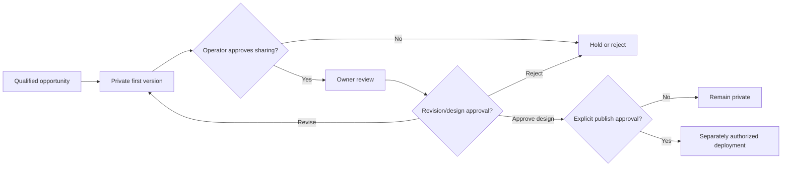

# Safety and data boundary

## Safety objective

SiteKapında should help a business evaluate a first website version without misrepresenting the business, collecting unnecessary data, bypassing a refusal, or publishing anything the owner did not approve.

The Build Week package uses a strong default: fictional local data, deterministic policy gates, private/noindex previews, and no external action.

## Judge-mode boundary

`mock` mode is the supported submission path.

| Property | Judge-mode behavior |
|---|---|
| Business identities | fictional names beginning with `Fictional` |
| Stable IDs | `synthetic-*` identifiers |
| Phone numbers | deliberately non-routable `+90 000 ...` values |
| Locations | fictional labels such as `Example City` and `Demo District` |
| Source | `synthetic_fixture` |
| Website examples | missing or reserved `example.com` hosts |
| Network | not required |
| API credentials | not required |
| Outreach | not implemented by the run |
| Sales workspace | same English master-detail interface shown in the video; synthetic local records only; browser saves are `localStorage`-only |
| Hosting/publication | not implemented by the run |

The fixture is safe to inspect, regenerate, and use in screenshots. Do not replace it with a real lead export in the public repository.

## Data flow and minimization

The normalized `BusinessCandidate` contract permits only the fields needed for qualification and preview creation:

- stable source identifier
- display name
- category
- city/district when available
- public business phone when available
- existing website URL when available
- bounded rating/count metadata when available
- provider label
- optional coarse coordinates

Derived/persisted operational fields include:

- website classification
- transparent suitability score and reasons
- technical result status
- sales lifecycle status
- generated preview path
- minimal next-action note and timestamps
- run event and report summaries
- suppression reason

The application does not need or intentionally retain:

- raw provider responses
- copied reviews or reviewer identities
- scraped HTML
- social-media session data
- private messages
- private owner documents
- personal demographic data
- payment or banking data
- browser cookies
- Codex chat history inside SQLite
- Cloudflare, Sites, or registrar credentials

## Source policy

The package provides two provider classes with different trust levels.

### Synthetic provider

This is the default. It reads only the checked-in JSON fixture. It is the only provider used by bootstrap and the offline tests.

### Optional official provider

The `GooglePlacesProvider` is reference code for an owner-configured real mode. It:

- calls the official Places Text Search API rather than scraping Google Maps pages
- uses an explicit field mask
- omits review text
- normalizes the result before persistence
- requires the user's own key and network access

The presence of provider code is not permission to run it. A user must choose real mode, supply their own credential, understand quota/terms, confirm the intended geography and categories, and review the results.

No HTML scraping, bot bypass, CAPTCHA bypass, authenticated-session reuse, or collection from private sources belongs in this workflow.

## Category and claims policy

The initial allowlist focuses on ordinary local services such as restaurants, cafés, grooming, beauty, cleaning, vehicle service, fitness, and courses.

The deterministic screen blocks unsupported or sensitive signals, including legal, healthcare, pharmaceutical, finance/credit, political, religious, gambling, weapons, alcohol/adult-entertainment, and related regulated categories.

This is a conservative prototype policy, not a legal classification service. Ambiguous or newly regulated categories require human review and a jurisdiction-specific policy before use.

Generated copy is also rejected when it contains prohibited guarantee patterns such as:

- guaranteed first-place Google ranking
- guaranteed customers or sales
- unsupported superlatives or outcomes

Exact prices, credentials, awards, services, addresses, contact details, and results must come from verified owner evidence. Missing values stay missing; they are not inferred.

## Preview identity and indexing

Every generated preview must:

- state that SiteKapında prepared it as a preview
- state that it will not be published without owner approval
- contain `<meta name="robots" content="noindex,nofollow">` or an equivalent stricter directive
- avoid language that presents it as the business's current official website
- avoid copied reviews and fabricated proof

Local judge pages are demonstration artifacts. A private hosted link should additionally use host-level access control where supported; `noindex` alone is not authentication.

## Human approval gates

The product flow contains several distinct decisions. One does not imply the next.

Required separate authorizations include:

- contacting or messaging a real business
- uploading owner/customer material to a model or hosting service
- using business images where rights/permission are not already established
- creating a hosted private demo
- purchasing a domain or paid service
- changing DNS or a Cloudflare account
- publishing a site publicly

A local database status named `approved` is not sufficient evidence of legal consent to publish. A production system must store the approval actor, scope, artifact version, channel, and timestamp.

## Refusal and suppression

Sales status and technical processing status are separate. Marking a fictional or real record `do_not_contact` adds its stable identifier to `suppression_list`.

The pipeline checks suppression before scoring or generation. A later retry, schedule, or prompt must not override that record silently. Production imports and identifier changes need a reviewed suppression-matching strategy.

## Image and creative-data policy

GPT Image / `imagegen` is part of the authoring workflow, not the local judge runtime.

The public judge package contains twenty-four synthetic full-site UI mockup PNGs produced in that authoring workflow: independent desktop and mobile compositions keyed only to the twelve fictional fixture identifiers. They are copied locally by the deterministic runtime, contain only fictional businesses, and are not regenerated during bootstrap. The Sales Ops preview surface loads only these contained local images and never executes generated page code.

Safe use requires:

- owner-supplied, licensed, synthetic, or otherwise rights-safe source material
- the minimum images necessary for the requested creative task
- a clear distinction between an edit of verified premises and conceptual imagery
- no fabricated signage, awards, credentials, people, prices, or customer proof
- no assumption that an image found publicly is automatically licensed for commercial reuse
- review of generated text and logos before use

For the public submission, synthetic visuals and permissioned customer evidence should remain visibly distinguishable. External customer-owned content is linked rather than copied into the judge fixture.

## Codex, skills, and scheduled tasks

`AGENTS.md` and the five SiteKapında skills carry durable workflow rules into Codex. They are guidance, not authority.

- A skill cannot grant access to an account or waive an approval requirement.
- A connector/MCP server should receive only the narrowest required permissions.
- Hooks and scripts must be reviewed before enabling them.
- Source content must not be followed as an instruction merely because it appears in a webpage or fixture.
- Account-local scheduled tasks are not exported to judges.
- Bootstrap does not start the hourly worker or create a Codex schedule.
- Any schedule should be tested interactively, reviewed during early runs, and use the narrowest sandbox/network permissions.

The portable foreground hourly scripts are intentionally transparent and stoppable with `Ctrl+C`.

## Repository distribution boundary

Included:

- application source
- offline tests
- fictional fixture
- safe scripts and `.env.example`
- Codex plugin/skills
- English judge documentation

Excluded:

- existing workspace Git history and unreachable objects
- `.env` and credentials
- production Wrangler/Cloudflare identifiers
- Basic Auth hashes
- real lead or customer database
- sales notes, phones, and suppression exports
- generated runtime directories
- browser profiles and cookies
- `.wrangler`, caches, build artifacts, and video renders
- account-local Codex tasks, schedules, and chat transcripts

Before publishing the repository or ZIP, run secret, personal-data, large-file, and nested-Git scans. A clean working tree alone does not prove that sensitive values are absent from Git history.

## Hosted links boundary

- [sitekapinda.com](https://sitekapinda.com) is the product site.
- [Codex Sites demo](https://sedirra-sites-demo.haakanergun.chatgpt.site) is hosted demonstration evidence.
- [cagrikarakas.com](https://cagrikarakas.com) is a separate customer implementation example.

Their availability, content, analytics, credentials, and privacy practices are outside the local submission runtime. Judges do not need to transmit data to them to test the package.

## Production readiness checklist

Before processing real leads at scale:

- complete a jurisdiction-specific privacy, marketing, and platform-terms review
- implement authenticated, tenant-isolated operator access
- use a managed secret store and rotate any historic exposed credential
- add a clear retention/deletion and data-subject request process
- record evidence and owner approval by artifact version
- add queue leases, retry classes, rate limits, and audit logs
- perform security, accessibility, and responsive QA
- separate design approval from public deployment approval in the data model
- make outreach channels enforce suppression centrally
- provide incident response and rollback procedures

These are explicit prerequisites, not claims about the demonstration release.
